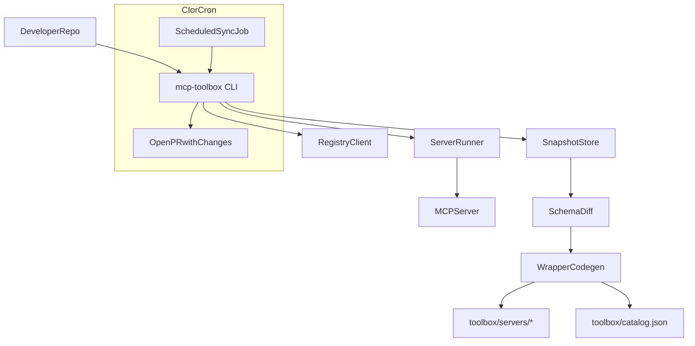

# MCP Toolbox MVP Plan (registry-latest + codegen wrappers, CLI via @clack/prompts)

## Goals and constraints

- **Goal**: Provide a **drop-in repo tool** (like ESLint/Prettier) that generates a **filesystem SDK** of MCP tool wrappers so any IDE LLM can discover capabilities by reading code, not by loading tool schemas into context.
- **No “agent session orchestration”**: no per-session prompt injection or custom agent loop. Instead, rely on **repo-local artifacts** (generated code + tiny instruction docs) that IDE agents can read naturally.
- **Auto-sync with upstream**: continuously detect upstream MCP schema changes and keep generated wrappers updated (ideally via automated PRs).
- **Defaults from decisions**:
  - **Ecosystem**: Node.js + TypeScript first; design interfaces so Python codegen can be added later.
  - **Discovery**: official MCP registry; **track latest automatically**.
  - **CLI UX**: interactive flows use **`@clack/prompts`**; CI-friendly flows remain non-interactive.

## Product UX (developer)

- Install:
  - `npm i -D mcp-toolbox` (or `bun add -d mcp-toolbox`)
  - `npx mcp-toolbox init`
- Discover servers:
  - `npx mcp-toolbox registry search "google drive"`
  - `npx mcp-toolbox add <registryId>` (interactive selection supported)
- Generate/refresh SDK:
  - `npx mcp-toolbox sync` (introspect → snapshot → diff → generate)
- Use in code:
  - LLMs (and humans) import from `./toolbox/servers/<server>/index.ts`

## CLI design (clack + scriptable subcommands)

### Libraries

- Command parsing: **keep minimal and stable** (pick one): `commander` or `yargs` (implementation detail).
- Interactive prompts: **`@clack/prompts`** for:
  - `init` (confirm paths, instruction hints, stdio allowlist)
  - `add` (search + pick from registry results)
  - `remove` (pick installed server)
  - Optional `sync` confirmation for breaking changes (only when run interactively)

### Non-interactive operation

All commands must support flags so CI can run without prompts:

- `init --yes`
- `add <registryId> --yes`
- `sync --yes`
- `sync --check` (never prompts; fails if out of sync)

### Output conventions

- Use clack’s `intro/outro`, `spinner`, and `note` for interactive runs.
- For `--json`, print machine-readable output (no spinners).
- For CI, exit codes are the contract; logs are concise.

## Repo artifacts (IDE-agnostic discovery)

Create/commit these outputs:

- `toolbox/catalog.json`: small searchable list (server → tool names + 1-line descriptions + tags)
- `toolbox/servers/<serverSlug>/*`: generated wrappers + `index.ts` barrel
- `toolbox/README.md`: a short “how to use toolbox” doc for humans/LLMs
- Optional “instruction hints” (generated once, tiny):
  - `CLAUDE.md`, `.github/copilot-instructions.md`, `.cursorrules` (only if present/desired) pointing to `toolbox/README.md`

## System architecture

## MVP scope (implementation)

### 1) Registry discovery (latest)

- Implement `registry search`, `registry list`, `registry show`.
- Store selected servers in `mcp-toolbox.config.ts` with:
  - `registryId`
  - `channel: "latest"`
  - `transportHints` from registry (stdio vs http)
  - `runSpec` (how to run it to introspect)

**Assumption for MVP**: registry provides enough metadata to connect/run servers. Where it doesn’t, allow manual overrides in config (`run.command`, `http.url`).

### 2) Introspection: tools/list → deterministic snapshots

- For each configured server:
  - Connect and run MCP handshake (`initialize`)
  - Call `tools/list`
  - Save snapshot:
    - `toolbox/.snapshots/<serverSlug>/<timestamp>.json`
    - `toolbox/.snapshots/<serverSlug>/latest.json` (copy)
  - Save metadata:
    - `toolbox/.snapshots/<serverSlug>/latest.meta.json` with:
      - `retrievedAt`, `registryId`, `channel`, `transport`, `serverReportedVersion` (if any)
      - `schemaFingerprint` (hash of normalized tool schemas)
      - `sourceFingerprint` (registry entry hash, plus runSpec)

Normalization rules:

- Sort tools by name.
- Canonicalize JSON Schema by sorting keys and removing volatile fields (timestamps/examples if noisy).

### 3) Diff engine: breaking vs additive

- Compare previous `latest.json` to new snapshot.
- Classify changes:
  - Breaking: tool removed/renamed, required input added, input type changed, output schema changed (configurable strictness).
  - Non-breaking: tool added, optional input added, description changes.
- Emit report:
  - `toolbox/.reports/<serverSlug>/<timestamp>.md`

### 4) Code generation: TypeScript wrappers (thin)

Generate:

- `toolbox/servers/<serverSlug>/tools/<toolFn>.ts`
- `toolbox/servers/<serverSlug>/index.ts`
- `toolbox/client.ts` (runtime helper to call tools)

Wrapper shape:

- Stable tool ID mapping: `toolId = <serverSlug> + "::" + <toolName>`
- Function naming: `camelCase(tool.name)` with collision handling suffix.
- Types: minimal TS types from JSON Schema; fall back to `unknown` with JSDoc pointing to raw schema when needed.

### 5) Runtime: calling the MCP server

Provide minimal runtime transports:

- HTTP transport (if registry supports remote servers).
- stdio transport: spawn local command and speak MCP over stdio.

Security note:

- Default to HTTP when available.
- stdio requires explicit opt-in (set in config / interactive prompt in `init`).

### 6) “LLM discoverability” without prompt injection

- Generate `toolbox/README.md` + `toolbox/catalog.json`.
- Optional instruction pointers (generated by `init`, via clack prompt): `CLAUDE.md`, `.github/copilot-instructions.md`, `.cursorrules`.

### 7) Staying in sync automatically (tracking latest)

- `sync`: introspect all → diff → generate changed.
  - If run interactively and breaking changes detected: show clack confirmation (or require `--yes`).
- `sync --check`: no prompts; fails if upstream changed but wrappers not regenerated.
- GitHub Action template: nightly cron runs `sync` and opens PR if changes exist.

## Data model (minimal)

- `mcp-toolbox.config.ts`
  - `servers: Array<{ registryId: string; channel: "latest"; overrides?: { run?: {...}; http?: {...} } }>`
  - `generation: { outDir: "toolbox"; language: "ts" }`
  - `security: { allowStdioExec: boolean; envAllowlist: string[] }`
  - `cli: { interactive: boolean }` (optional; default auto-detect TTY)

## CLI commands (MVP)

- `init` (interactive via clack; supports `--yes`)
- `registry search|list|show`
- `add` (interactive selection via clack; supports `add <id> --yes`)
- `remove` (interactive selection via clack; supports `remove <id> --yes`)
- `introspect [serverSlug]`
- `diff <serverSlug> --from <a> --to <b>`
- `generate [serverSlug]`
- `sync [--yes] [--check] [--json]`

## Milestones

- Milestone A: CLI skeleton + registry + introspect + snapshot + TS codegen + catalog.
- Milestone B: diff + `--check` + CI workflow template that opens PRs.
- Milestone C: transport hardening + better schema normalization + collision handling.